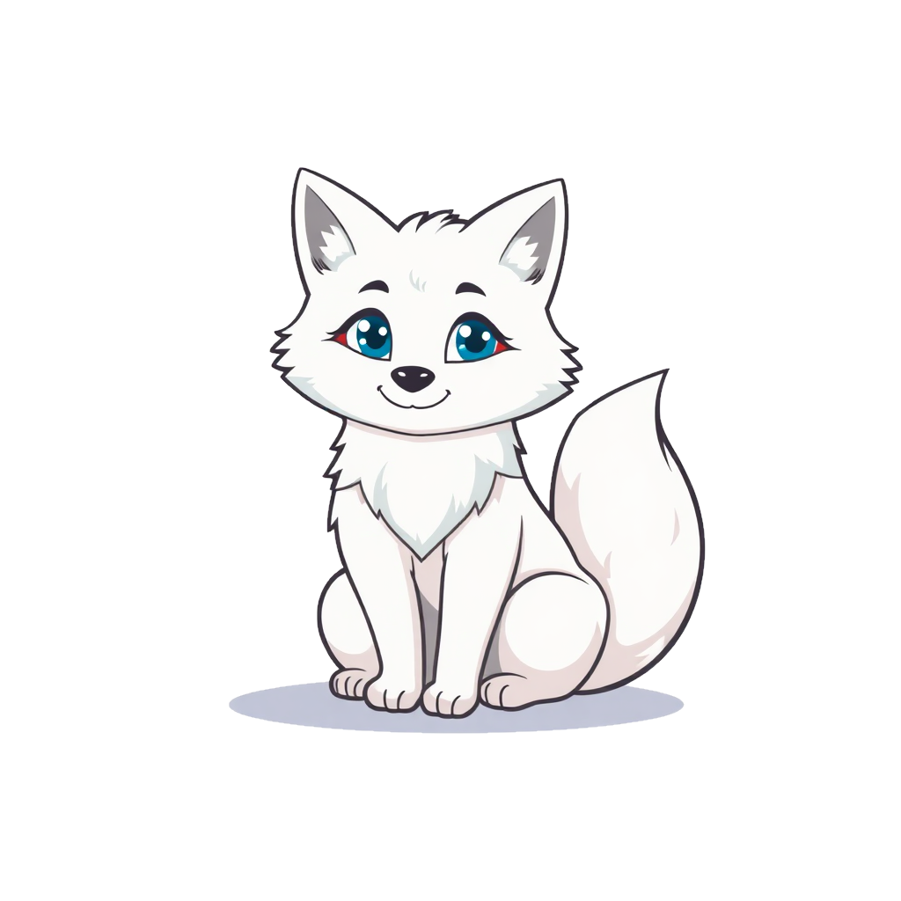
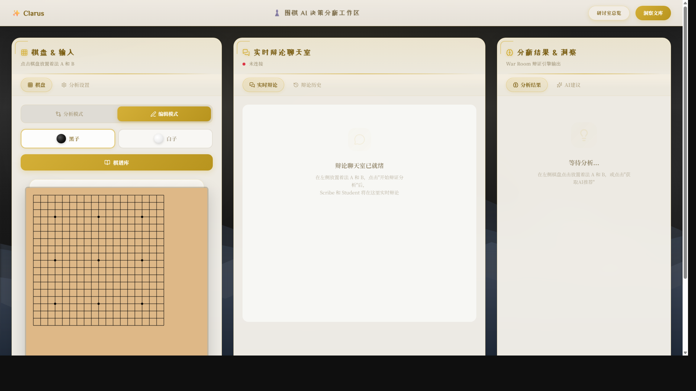
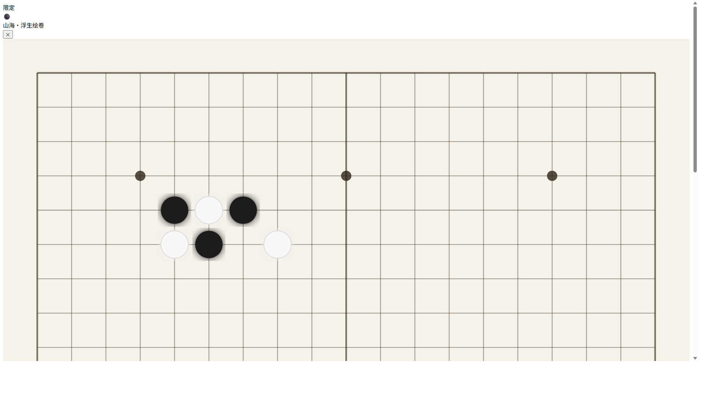
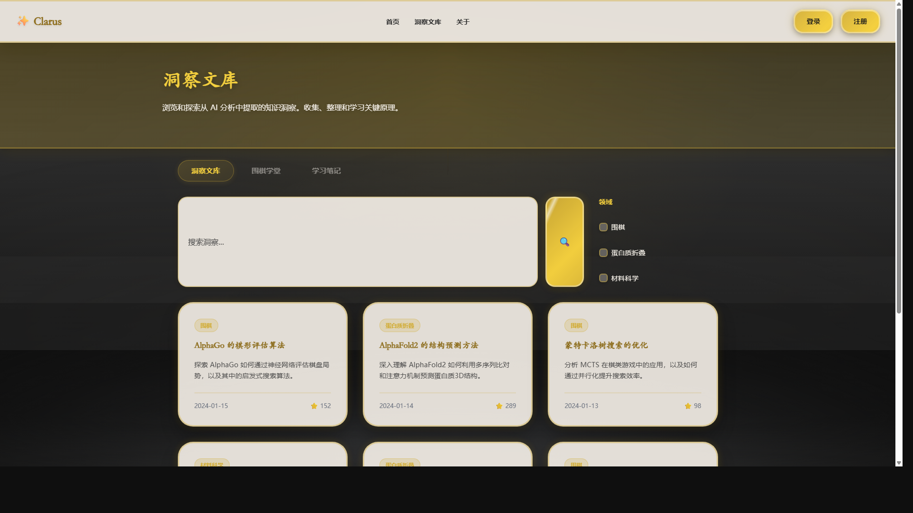

<p align="center">
  
</p>

<h1 align="center">Clarus</h1>

<p align="center">
  <strong>Making Superhuman AI Transparent — Starting with Go/Weiqi</strong><br/>
  <sub>Multi-agent debate system that cracks open the AI black box</sub>
</p>

<p align="center">
  <a href="#demo">Demo</a> &bull;
  <a href="#features">Features</a> &bull;
  <a href="#architecture">Architecture</a> &bull;
  <a href="#quick-start">Quick Start</a> &bull;
  <a href="#the-bigger-picture">Beyond Go</a> &bull;
  <a href="CONTRIBUTING.md">Contributing</a>
</p>

<p align="center">
  
  
  
  
  
  
</p>

---

## The Problem

Superhuman AI systems like AlphaGo and KataGo can beat every human player — but **nobody can explain why they make the moves they do**. Their decision logic is a black box. Existing tools show you *what* the AI recommends, but never *why*.

## The Solution

**Clarus** uses a multi-agent debate system to translate KataGo's raw mathematical outputs into **human-understandable reasoning** — then **validates** that the explanation actually works through a novel prediction-based verification loop.

> *"If a student AI can read the explanation and find the right move on the board, the explanation works. If not, it gets rewritten — automatically."*

---

## Demo

<p align="center">
  
</p>

<p align="center"><em>The War Room — AI agents debate move analysis in real time</em></p>

<details>
<summary><strong>More screenshots</strong></summary>

<p align="center">
  
  <br/><em>Interactive Go board with stone placement and game records</em>
</p>

<p align="center">
  
  <br/><em>Insight Library — browse verified AI analysis and learning materials</em>
</p>

</details>

---

## Features

| Feature | Description |
|---------|-------------|
| **Multi-Agent War Room** | 4 specialized AI agents debate and verify each explanation |
| **Prediction Verification** | A student AI tries to find the move from the explanation alone — if it can't, the explanation gets rewritten |
| **Contrastive Learning** | Explains *why* move A beats move B, not just what each move does |
| **Real-Time WebSocket** | Live streaming analysis with agent dialogue visible in the UI |
| **Feedback Loop** | When verification fails, the student explains *what it misunderstood* — targeted, not generic |
| **Context-Action-Logic** | Structured explanation format: situation, recommended action, mathematical reasoning |

---

## Architecture

```
                           ┌─────────────────┐
                           │   Board State    │
                           │  + Two Moves     │
                           └────────┬─────────┘
                                    │
                    ┌───────────────▼───────────────┐
                    │      GRANDMASTER (KataGo)      │
                    │   Parallel simulation → V_A, V_B│
                    └───────────────┬───────────────┘
                                    │
                    ┌───────────────▼───────────────┐
                    │      DELTA HUNTER (Python)     │
                    │   ΔV = what changed & why      │
                    └───────────────┬───────────────┘
                                    │
              ┌─────────────────────▼─────────────────────┐
              │            VERIFICATION LOOP               │
              │                                            │
              │   ┌──────────┐        ┌──────────┐        │
              │   │  SCRIBE  │──text──▶│ ARBITER  │        │
              │   │ (Teacher)│        │(Student) │        │
              │   │          │◀─fix───│          │        │
              │   └──────────┘        └──────────┘        │
              │                                            │
              │   Correct? ──▶ Publish ✓                   │
              │   Wrong?   ──▶ "I misread 'press' as       │
              │                'attack', should be          │
              │                'connect'" ──▶ Retry (≤3x)  │
              └────────────────────────────────────────────┘
```

| Agent | Role | Backbone | Function |
|-------|------|----------|----------|
| **Grandmaster** | Oracle | KataGo | Generates ground truth vectors (winrate, territory, score) |
| **Delta Hunter** | Analyst | Python | Extracts meaningful differences between moves |
| **Scribe** | Teacher | Gemini LLM | Writes explanations using `Context → Action → Logic` |
| **Arbiter** | Student | Gemini LLM | Reads explanation blind, predicts the correct move |

---

## Quick Start

### Option 1: Docker (Recommended)

```bash
git clone https://github.com/fengxuebailu/clarus.git
cd clarus
cp backend/.env.example backend/.env
# Edit backend/.env with your Gemini API key and KataGo path

docker compose up
```

Open http://localhost:3000/workspace-go.html

### Option 2: Manual Setup

```bash
git clone https://github.com/fengxuebailu/clarus.git
cd clarus/backend

# Environment
cp .env.example .env
# Edit .env with your Gemini API key and KataGo path

# Python
python -m venv venv
source venv/bin/activate  # Windows: venv\Scripts\activate
pip install -r requirements.txt

# Launch
uvicorn app.main:app --reload --port 8000
```

Open `frontend/workspace-go.html` in your browser.

### Prerequisites

- Python 3.9+
- [KataGo](https://github.com/lightvector/KataGo) installed locally
- [Google Gemini API key](https://aistudio.google.com/apikey) (free tier works)

---

## How It Works

**Step 1 — Ground Truth**: KataGo evaluates two candidate moves in parallel, producing mathematical vectors (winrate, score lead, territory ownership for every intersection).

**Step 2 — Delta Extraction**: The Delta Hunter compares the vectors and identifies what changed — which territories shifted, how the winrate swung, what tactical patterns emerged.

**Step 3 — Explanation**: The Scribe translates deltas into structured reasoning:

> *"In a double-atari position with 3 liberties each, extend rather than capture the ko. Extending preserves connection to the living group. Consequence: liberties 4 vs 2 = you survive."*

**Step 4 — Verification**: The Arbiter reads *only* the abstract principle (no coordinates, no board) and predicts which move is correct. If wrong, it explains its confusion, and the Scribe rewrites. Max 3 rounds.

---

## Project Structure

```
clarus/
├── frontend/                  # Web UI
│   ├── workspace-go.html          # Main analysis workspace
│   ├── go-demo.html               # Interactive Go board
│   ├── go-demo.css / .js          # Board styles & logic
│   ├── insight-library.html       # Knowledge base
│   └── ...                        # Other pages
├── backend/
│   ├── app/
│   │   ├── agents/                # AI agent implementations
│   │   │   ├── grandmaster.py         # KataGo interface
│   │   │   ├── scribe.py              # Explanation generator
│   │   │   ├── arbiter.py             # Prediction verifier
│   │   │   ├── delta_hunter.py        # Difference analyzer
│   │   │   └── prompts.py             # System prompts
│   │   ├── seminars/
│   │   │   └── war_room.py           # Orchestration engine
│   │   ├── api/                   # FastAPI routes
│   │   ├── core/                  # Config & KataGo client
│   │   └── main.py
│   ├── tests/                 # Test suite
│   ├── scripts/               # Setup & launch scripts
│   ├── Dockerfile
│   └── requirements.txt
├── docs/                      # Documentation
├── assets/mascot/             # Arctic fox mascot 🦊
├── docker-compose.yml
├── CONTRIBUTING.md
└── LICENSE
```

---

## API

| Method | Endpoint | Description |
|--------|----------|-------------|
| `POST` | `/api/go/analyze` | Analyze a position with two candidate moves |
| `POST` | `/api/go/analyze/batch` | Batch analysis |
| `GET`  | `/api/go/health` | Health check with KataGo status |
| `GET`  | `/api/go/concepts` | List Go concepts |
| `WS`   | `/api/ws/analyze` | Real-time streaming analysis |

Full API docs available at http://localhost:8000/api/docs when running.

---

## The Bigger Picture

Go is just the starting point. The core innovation — **prediction-based verification of AI explanations** — applies to any domain where superhuman AI makes opaque decisions:

| Domain | Verification Question |
|--------|----------------------|
| **Medical AI** | Can a doctor, reading only the explanation, arrive at the same diagnosis? |
| **Trading AI** | Can an analyst, reading the rationale, predict the same position? |
| **Autonomous Driving** | Can an engineer, reading the decision log, predict the system's action? |
| **Legal AI** | Can a lawyer, reading the reasoning, predict the same ruling? |

If the explanation passes the prediction test, it works. If not, rewrite it until it does.

---

## Roadmap

- [ ] SGF file import/export
- [ ] Full-game review mode
- [ ] User accounts & learning progress
- [ ] Seminar II: Strategy Room (macro-level analysis)
- [ ] Multi-language explanations
- [ ] Extend verification framework beyond Go
- [ ] Published research paper on prediction-based XAI

---

## Contributing

We welcome contributions from Go players, AI researchers, and developers. See [CONTRIBUTING.md](CONTRIBUTING.md) for details.

---

## License

MIT — see [LICENSE](LICENSE).

---

<p align="center">
  
  <br />
  <em>Built with curiosity. Making AI explain itself.</em>
</p>
